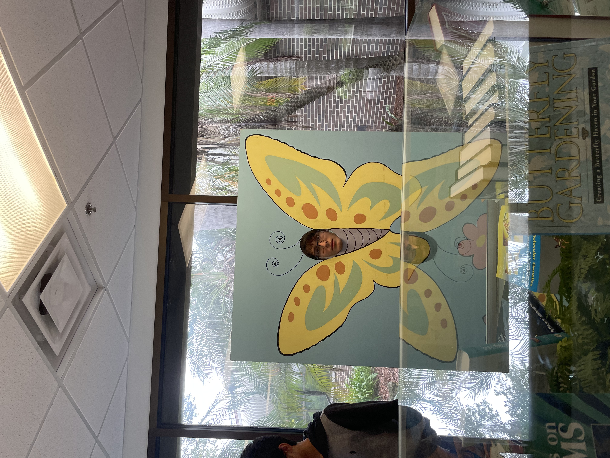

---
# Feel free to add content and custom Front Matter to this file.
# To modify the layout, see https://jekyllrb.com/docs/themes/#overriding-theme-defaults
title: About me
layout: page
#format for links is [jekyllrb.com](https://jekyllrb.com/)
---
Hi! I'm Alex Sareh and I'm an undergraduate student at Georgia Tech, pursuing a Bachelor of Science in Computer Engineering with concentrations in Computing Hardware & Emerging Architectures and Systems & Architecture.

Be sure to checkout the projects page!

Some pictures of me:
{: width="300" }

(This website was made with jekyll)
